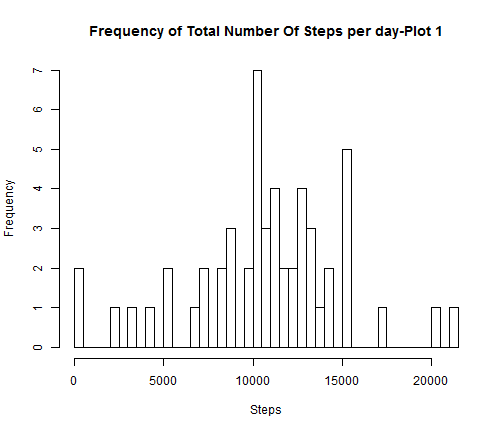

Reproducible Research: Peer Assessment 1
========================================================

The analysis is about measuring daily activity that people indulge in,in terms of 
number of steps taken by hour. We will also look at how daily activity varies across
weekdays and weekend i.e we will study the influence that weekends and weekdays have 
on daily activity.

The data has been recorded by activity monitoring devices such as [Fitbit](http://www.fitbit.com/), [Nike Fuelband](www.nike.com/us/en_us/c/nikeplus-fuelband) and [Jawbone Up](https://jawbone.com/up).

# Dataset
The devices collect data at 5 minute intervals through out the day. The data
consists of two months of data from an anonymous individual collected during
the months of October and November, 2012 and include the number of steps
taken in 5 minute intervals each day.

The dataset can be downloaded by clicking [Activity Montoring Data](https://d396qusza40orc.cloudfront.net/repdata%2Fdata%2Factivity.zip)

The variables included in this dataset are:
. steps: Number of steps taking in a 5-minute interval (missing values are
coded as NA)
. date: The date on which the measurement was taken in YYYY-MM-DD
format
. interval: Identifier for the 5-minute interval in which measurement was
taken

There are a total of 17,568 observations in the dataset.

## Loading and preprocessing the data
We will first load the required libraries and dataset into r.


```r
library(plyr)
library(lattice)
Activity<-read.csv("C:/Users/Sameer/RepData_PeerAssessment1/activity.csv")
```

Now we will remove the missing values from the dataset to make it suitable for processing.

We also need to summarise the data so that we have mean,median and total number of steps taken per day. We then use this dataset for further analysis.


```r
Activity_Clean<-Activity[-which(is.na(Activity$steps)),]

Activity_Smry<-ddply(Activity_Clean,
                     c("date"),
                     summarise,
                     Mean_Step=mean(steps),
                     Median_Step=median(steps),
                     Tot_Steps=sum(steps))
```

## Histogram of the total number of steps taken per day


```r
hist(Activity_Smry$Tot_Steps,
     breaks=nrow(Activity_Smry),
     xlab="Steps", 
     main="Frequency of Total Number Of Steps per day-Plot 1")
```

 

## What is mean total number of steps taken per day?

```r
Mean<-mean(Activity_Smry$Tot_Steps)

Median<-median(Activity_Smry$Tot_Steps)
```

**Mean** of the number of steps taken per day is equal to 1.0766 &times; 10<sup>4</sup> and **Median** of the number of steps taken per day is equal to 10765.


## What is the average daily activity pattern?
We will first summarise data to include mean steps taken per interval.

```r
Activity_interval_Smry<-ddply(Activity_Clean,c("interval"),
                              summarise,Mean_Step=mean(steps))
```

### Time Series Plot and mean number of steps taken in each interval

```r
plot(x=Activity_interval_Smry$interval,
     y=Activity_interval_Smry$Mean_Step,
     type="l",xlab="interval",
     ylab="mean Steps")

abline(v=Activity_interval_Smry[which(Activity_interval_Smry$Mean_Step==max(Activity_interval_Smry$Mean_Step)),"interval"])
```

 


```r
Max_Activity_Interval<-Activity_interval_Smry[which(Activity_interval_Smry$Mean_Step==max(Activity_interval_Smry$Mean_Step)),"interval"]

Max_Steps<-max(Activity_interval_Smry$Mean_Step)
```

**Interval** with maximun number of steps is equal to 835 and **Maximum Number of Steps** taken is equal to 206.1698

# Imputing missing values
First we will calculate the total number of missing values

```r
tot_missing_values<-length(which(is.na(Activity$steps)))
```

**Total number of missing values** is equal to 2304

We will impute missing values with mean number of steps taken in that interval and
suumarise the new dataset to include Mean, Media and Total number of steps taken per
day.


```r
Activity = transform(Activity, steps = ifelse(is.na(steps), mean(Activity[Activity$interval==interval,"steps"], na.rm=TRUE), steps))

Activity_Smry_2<-ddply(Activity,c("date"),
                       summarise,
                       Mean_Step=mean(steps),
                       Median_Step=median(steps),
                       Tot_Steps=sum(steps))
```

## Histogram of the total number of steps taken per day 

```r
hist(Activity_Smry_2$Tot_Steps,
     breaks=nrow(Activity_Smry),
     xlab="Steps", 
     main="Frequency of Total Number Of Steps per day-Plot 2")
```

 


```r
Mean_New<-mean(Activity_Smry_2$Tot_Steps)
Median_New<-median(Activity_Smry_2$Tot_Steps)
```
##Are there differences in activity patterns between weekdays and weekends?
**New Mean** is equual to 1.0766 &times; 10<sup>4</sup> and **New Median** is 1.0766 &times; 10<sup>4</sup>.
Imputing missing values with Mean does not change the new mean and median.

## Activity Analysis by Weekdays and Weekends
We wil first add a new column **"day"** with two levels **"Weekday"** and **"Weekend"**"

```r
Activity$day <- ifelse(weekdays(as.Date(Activity$date)) %in% c("Saturday","Sunday"),
                       "weekend","weekday")

Activity$day<-as.factor(Activity$day)
```


We will summarise the data by "day" and "interval" to include Mean, Median and Total Number of Steps taken by in each interval segmented by "Weekend" and "Weekday" and then scale the data to standardise it.


```r
ActSmry_Day_Intvl<-ddply(Activity,
                         c("interval","day"),
                         summarise,
                         Mean_Step=mean(steps),
                         Median_Step=median(steps),
                         Tot_Steps=sum(steps))

ActSmry_Day_Intvl$Standardised_Steps<- as.numeric(scale(ActSmry_Day_Intvl$Mean_Step, 
                                                        center = TRUE, scale = TRUE))
```


## Time Series Plot segmented by "Weekday" and "Weekend"

```r
xyplot(Standardised_Steps ~ interval|day, 
       group=day,
       data=ActSmry_Day_Intvl, 
       ylab='Number of steps', 
       xlab='Interval', 
       panel=panel.superpose, 
       distribute.type=TRUE, layout = c(1, 2),
       col="blue", lwd=1, type='l')
```

 

